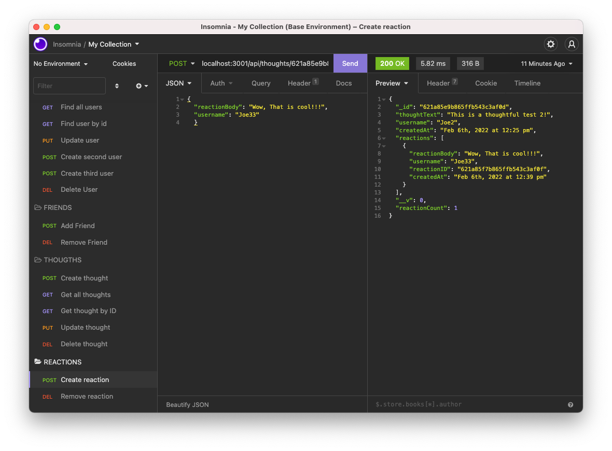
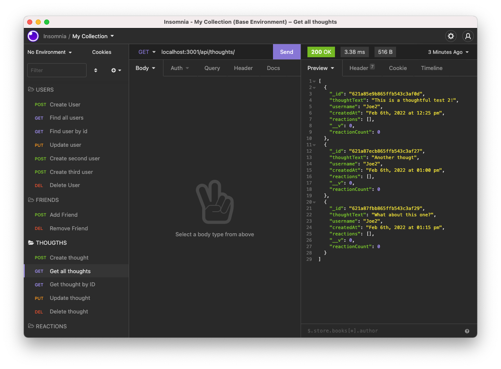
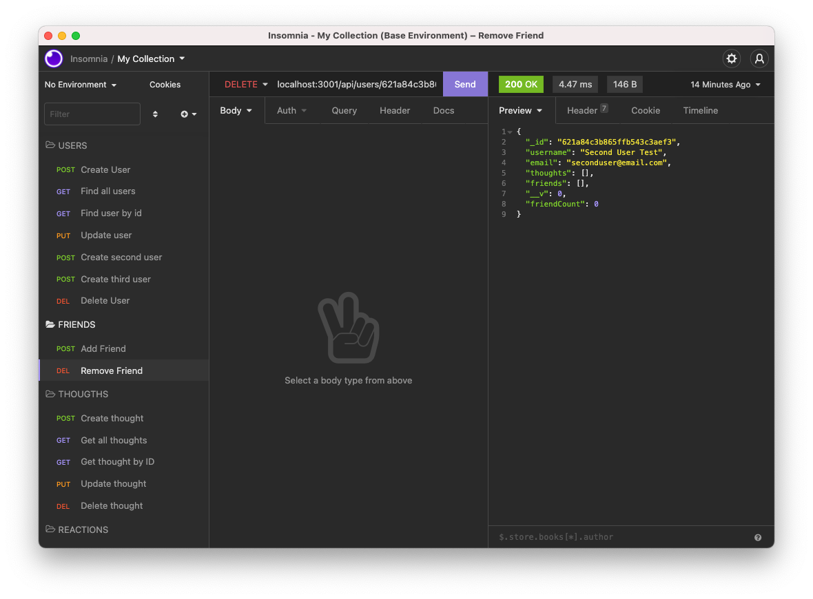
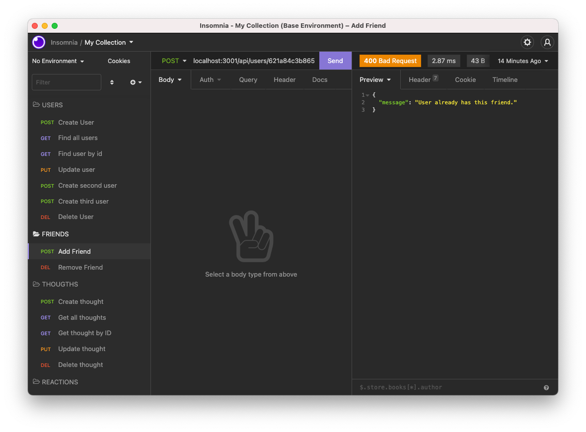
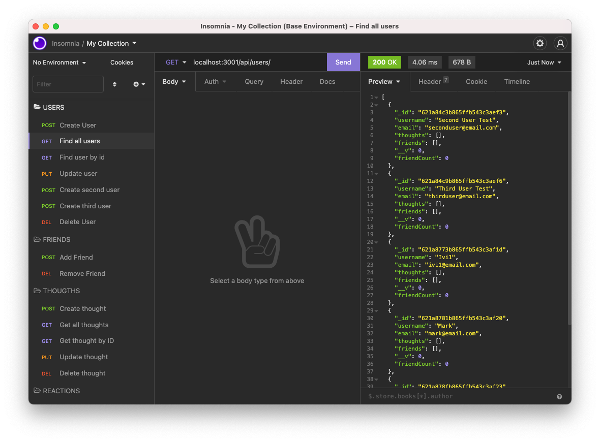

# Social Network API

## License

  
   
  
    
  
  <h2>Table of Contents</h2>
  
  * [Technologies](#tech)
  * [Description](#description)
  * [Usage](#usage)
  * [Screenshots](#scrs)
  * [Link to the live view](#live)
  * [Questions](#questions)

  
## Technologies
       
  

## Description
[Main Menu](#home)

MongoDB is a popular choice for many social networks due to its speed with large amounts of data and flexibility with unstructured data.  
My task was to build an API for a social network web application where users can share their thoughts, react to friends’ thoughts, and create a friend list. I used Express.js for routing, a MongoDB database, and the Mongoose ODM. 
Because it's a backend api I used insomnia to do the CRUD (create, read, update and delete) operations.

## Usage

[Main Menu](#home)
  
-Use the command line: "npm install" to install the dependencies; 
-To run the application, please run the command line: "npm start" (it will start the server using nodemon); 
-To test using insomnia use the following URL: "localhost:3001/api/" as a base for your tests.

 

## Screenshots 
<table>
  <tr>
    <td></td>
    <td></td>

  </tr>
  <tr>
    <td></td>
    <td></td>

  </tr>
  <tr>
    <td></td>
    <td></td>

  </tr>
  <tr>
    <td></td>
    <td></td>

  </tr>
  </table>
 

## Live view
[Main Menu](#home)

GitHub Repository-> <a href="https://github.com/ibarros19/SocNetApi" target="_blank">LINK</a> 
 
Video Demo-> <a href="https://" target="_blank">LINK</a> 

## Questions
[Main Menu](#home)

If you have any further questions, please feel free to contact me on GitHub at [ivibarros19](https://github.com/ivibarros19) or by email at [ivibarros19@gmail.com](ivibarros19@gmail.com).

